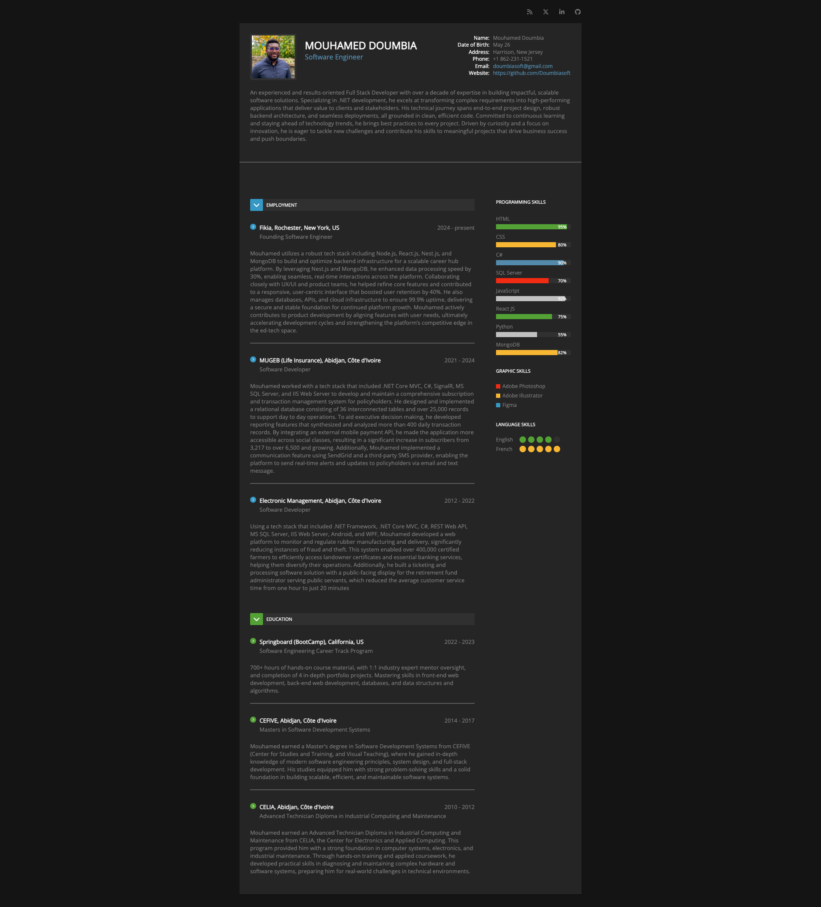

# Mouhamed Doumbia - Online Resume

A professional, responsive online resume built with pure HTML and CSS, showcasing modern web development skills and clean design principles.

### Live at: https://doumbiasoft.github.io/resume-html-css/

## Overview

This project presents a comprehensive digital resume for Mouhamed Doumbia, a Full Stack Software Engineer with over a decade of experience. The resume features a dark theme with carefully crafted typography and responsive design that looks professional across all devices.



## Features

- **Responsive Design**: Optimized for desktop, tablet, and mobile viewing
- **Dark Theme**: Modern dark color scheme with accent colors for better readability
- **Social Media Integration**: Direct links to professional profiles (LinkedIn, GitHub, X, RSS feed (HankerNews))
- **Skills Visualization**:
  - Programming skills with progress bars
  - Graphic design skills with color-coded indicators
  - Language proficiency with dot-based rating system
- **Professional and Education Sections**:
  - Personal information and contact details
  - Professional bio and summary
  - Employment history with detailed descriptions
  - Educational background
  - Technical and soft skills

## Technologies Used

- **HTML5**: Semantic markup structure
- **CSS3**: Custom styling with modern features including:
  - Flexbox for responsive layouts
  - CSS transitions and animations
  - Media queries for mobile responsiveness
  - Custom progress bars and visual indicators
- **Font Awesome 7**: Icons for social media and UI elements
- **Google Fonts**: Open Sans font family for clean typography

## File Structure

```
resume-html-css/
|--- index.html          # Main HTML structure
|--- styles/
|    |__ resume.css.      # All custom CSS styles
|
|----images
|    |__ momo.png        # Profile photo
|
|____ README.md          # Project documentation
```

## Design Highlights

- **Color Scheme**: Dark background (`#141414`, `#242424`) with light text (`#7a7a7aff`) and blue accents (`#538aab`)
- **Typography**: Open Sans font family for modern, readable text
- **Layout**: Two-column layout for optimal content organization
- **Interactive Elements**: Smooth transitions
- **Visual Indicators**: Progress bars, dots, and colored squares for skill representation

## Responsive Features

The design automatically adapts to smaller screens with:

- Stacked layout for mobile devices
- Adjusted spacing and typography
- Optimized content
